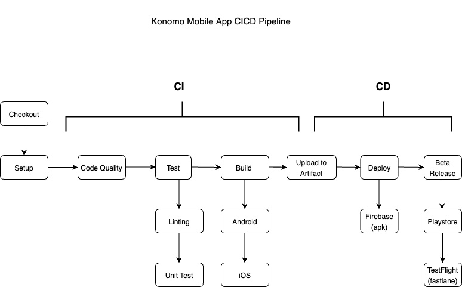

= KONOMO MOBILE APP

This repository houses the code base for the Konomo Mobile Application. It is a CI/CD pipeline for both the iOS and Android builds of the application. 
The mobile application is built using a Flutter CI/CD pipeline, with the help of other tools and packages.

== Architecture:

From checkout the pipeline starts in the setup stage, where in the dependencies are gathered for Flutter to run. This ranges from ensuring the appropriate Flutter, Java and Ruby versions are installed, on top of any other related packages. At this stage, everything is run using GitHub runners on an Ubuntu operating system.

Then it moves onto the code quality stage. Here Dart Code Metrics is used to analyse the dart code, from reporting code metrics to providing recommendations in the form of a report in the workflow.

After the code quality check, the Linting and Unit Testing take place. Using Flutter Analyser, the code is scanned and specific commands are tested to ensure there are no issues. This step requires the setup and code quality stages to be successful in order for it run.

The next stage is the build stage, this is where the Android and iOS packages are created. When an Android .apk is being built, the GitHub runner will be on Ubuntu. When the iOS .ipa package is being built, the runner will be on MacOS.

The packages are then stored as artefacts in the pipeline, then registered in GitHub packages. After this, a version tag is attached to the most recent changes and released to GitHub releases. Both the Android and iOS packages are also available here.

Once the packages have been created, they are then deployed to the deployment platforms using Fastlane and Firebase. Here they can be further tested, before being pushed into the Google Playstore and Apple Appstore.